Info requirement:
- A valid P4  credential
- Microsoft Workflows job that post message into Group chat , with channel webhook provided, e.g:
 "https://default2ca815949a7142a0a4870fc9de27d8.34.environment.api.powerplatform.com:443/powerautomate/automations/direct/workflows/xxxxxxxxxxxx"
- Deprecated: A Slack channel hook address (Setup with "GameContentNotifyBot" app on slack) e,g: 
 "https://hooks.slack.com/services/xxxxxx/xxxxxxxxx/xxxxxxxxxxxx"
-  Tool preset that has been setup based on [_template](presets/_template)

<!-- ROADMAP -->
## Roadmap

---
- [x] Convert powershell and bat script into python syntax
- [x] Support multiple-projects with preset system
    - [ ] Support mutli-thread to run job(s) simultaneously

- [x] Remove hardcoded P4V password, enabled .p4tickets on preset.
  - [ ] Generate .p4trust for first time preset login
- [ ] Develop Frontend and move on from CLI.
- [ ] Support both Slack and Workflows message posting

- [ ] Have a test case system for basic validation


See the open issues for a full list of proposed features (and known issues).

## Installation:

---
1. First, cd terminal into your root directory

2. Make new virtual env
```
python -m venv venv 
```

3. Activate venv
```
venv\Scripts\activate
```

4. Install dependencies

```
pip install -r requirements.txt  
```

## What is a preset

---
A preset can be known as an entity that tool will recognize as task, where task's will queue up and run as waterfall orderly.
For current state, we does not have an system that manage task's, but as core we can setup mutiple task's and delegate the tool to run them daily.


A preset consist following files:
```
root
  - presets
       - [Preset name]
            .p4config
            .p4tickets(Generated via p4 login)
            .p4trust ( N/A for now )
            config.json
```
You can also view [_template](presets/_template) preset for reference:
[.p4config](presets/_template/.p4config) , [config.json](presets/_template/config.json)

## Workflows (Power Automate) setup

---
<details>
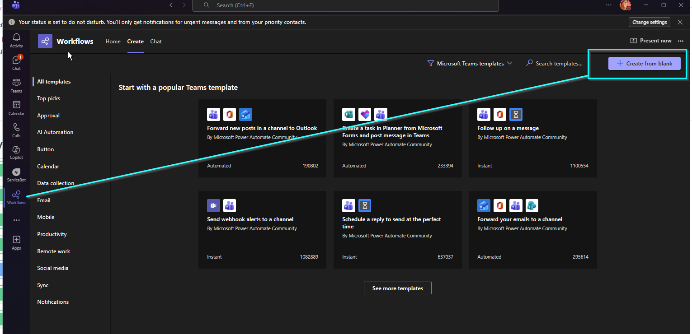
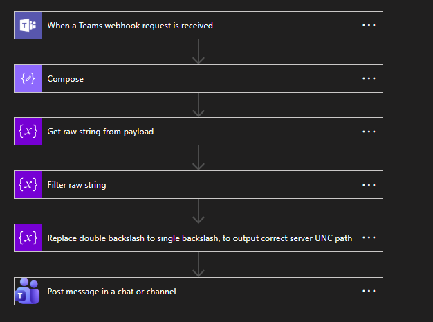
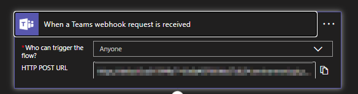
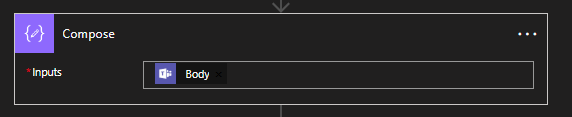
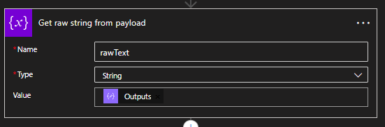
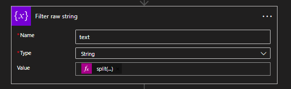
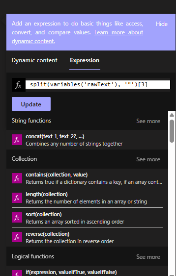
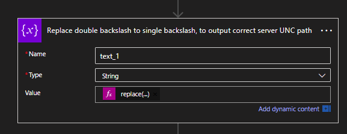
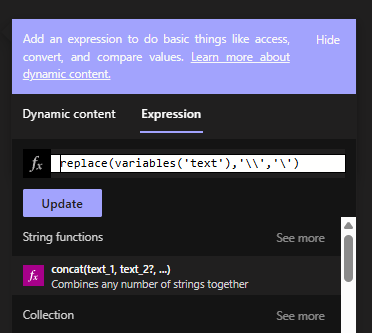

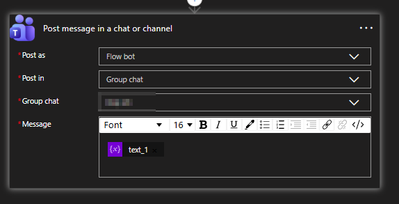
</details>

## Slack chatbot setup:

---
<details>
1. A Slack account within Virtuos Vietnam ( For SPX studio)
2. Create a new channel with blank template

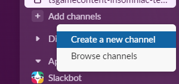
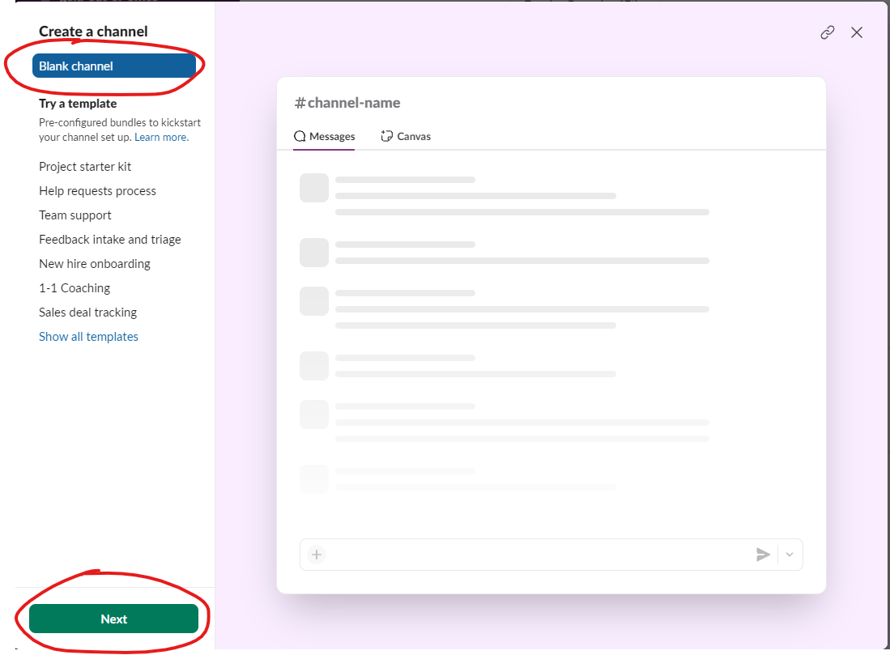
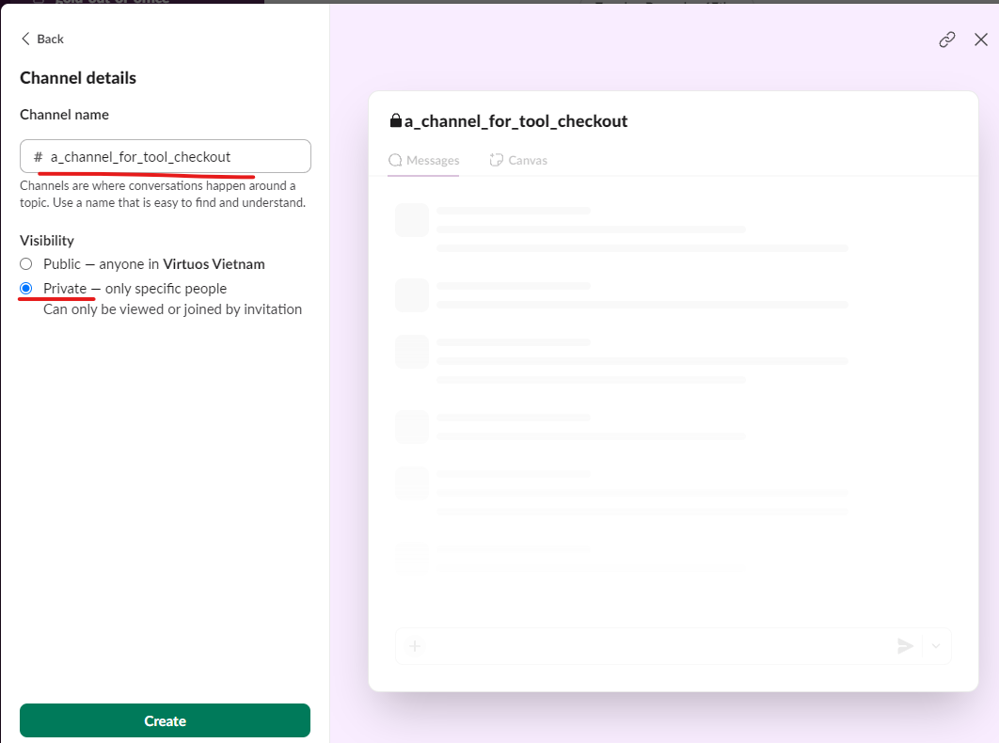
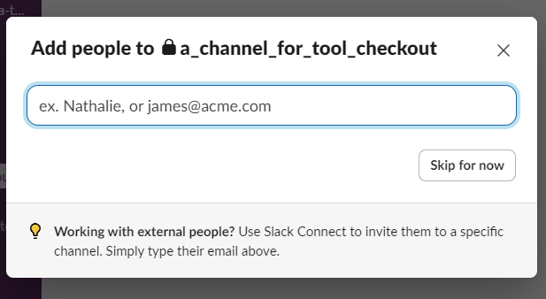
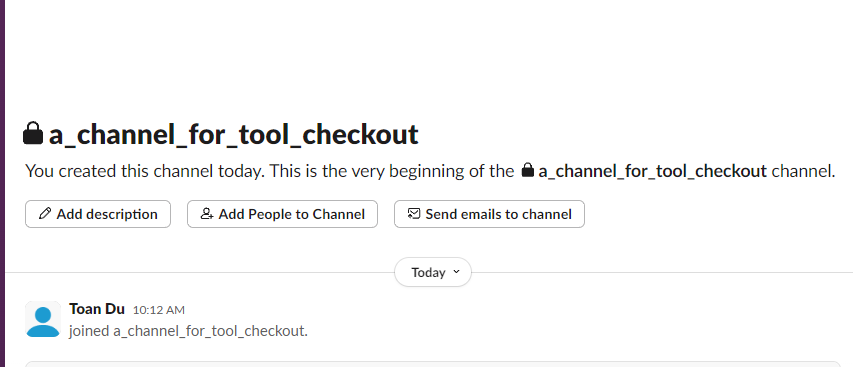
3. Add app into channel
https://slack.com/oauth/v2/authorize?client_id=697626830967.8011987954565&scope=incoming-webhook&user_scope=
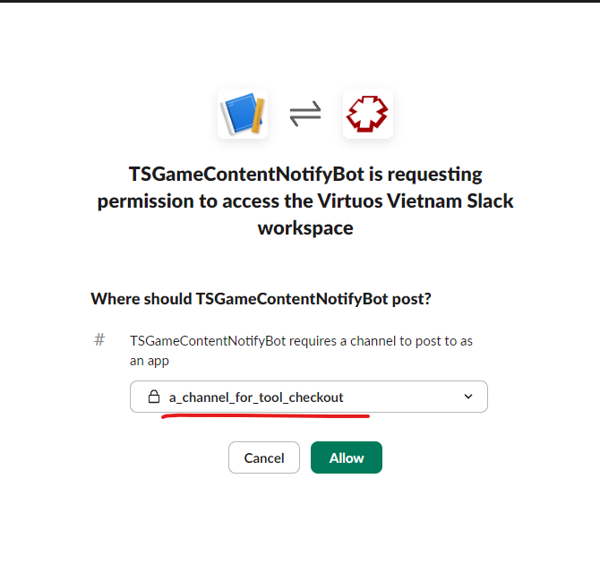
 
   *If you can’t find any channel it doesn’t mean the channels are not existed , studio DG agent has blocked the outgoing rules in behind the scene , so as SPX TA you can setup Slack chatbot via vngate for fast workaround*


4. Login website “https://api.slack.com/apps/A080BV1U2GM” and “Add new WebHook to Workspace”
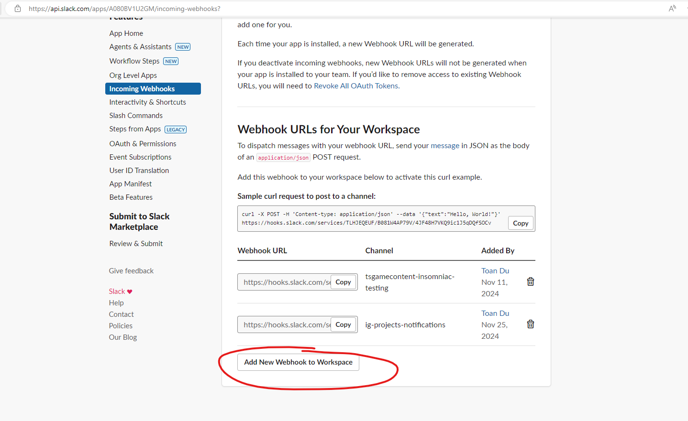
   If you cannot access this App with no authorization , please contact toan.du  to add you as Collaborators, or you can setup the chatbot app yourself in case of you needs full control over slack app.
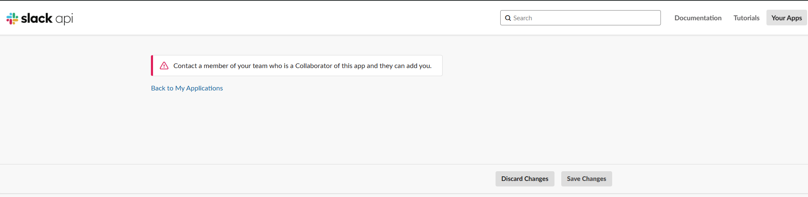
</details>